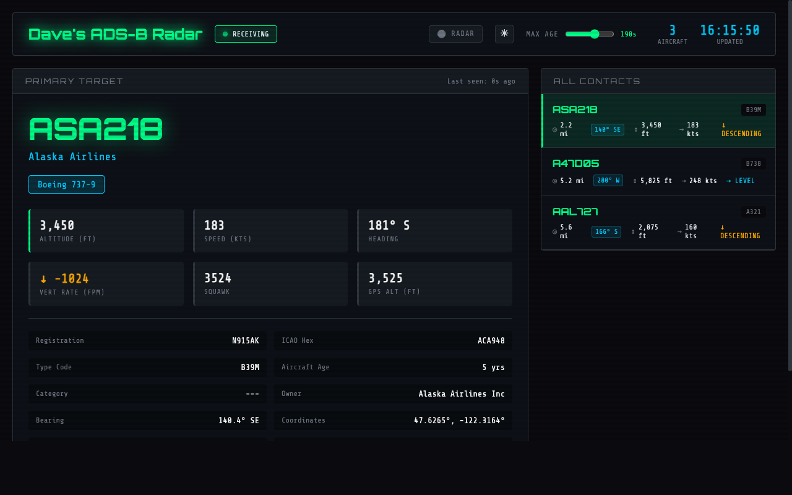
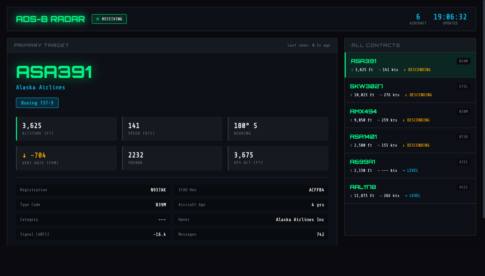

# Dave's Custom Flight Radar Dashboard



A real-time ADS-B flight tracking dashboard for Raspberry Pi with radar map overlay, emergency squawk alerts, auto-dimming, and aircraft classification.

## Screenshots


*Live view showing primary target with full aircraft details, contacts list, bearing, and distance*


*Aircraft detail panel showing registration, owner, type code, age, coordinates, and bearing*

## Features

- **Live radar map** — tap ⬤ RADAR to open a modal overlay showing aircraft on a map with coastline, range rings, and heading arrows. Auto-closes after 15 seconds
- **Bearing indicator** — compass bearing and cardinal direction from your antenna to each aircraft
- **Emergency squawk alerts** — flashing banner for squawk 7500 (hijack), 7600 (radio failure), 7700 (emergency) with auto-dismiss
- **Auto-dim at night** — screen dims after sunset using NOAA solar calculation (no API needed)
- **Aircraft classification** — MIL (gold) and HEAVY (cyan) badges for military and wide-body aircraft
- **Distance from antenna** — calculated via haversine formula, shown in miles
- Real-time tracking with automatic 2-second updates
- Altitude, speed, heading, vertical rate, coordinates
- Aircraft type lookup from OpenSky Network database
- Registration, operator, owner, and aircraft age details
- Configurable MAX AGE slider (10–300s, steps of 10)
- Web-based interface optimized for 800×480 kiosk touchscreen
- Demo mode for testing without hardware

## Customizing for Your Location

To use this dashboard at your own location, you need to update three things:

### 1. Set your antenna coordinates

Edit `flight_dashboard/app.py` and change these two lines:

```python
HOME_LAT = 47.650923    # ← your antenna latitude
HOME_LON = -122.346385  # ← your antenna longitude
```

### 2. Update the radar coastline

The radar overlay includes a local coastline outline. The default is the Puget Sound / Seattle area. To add your own coastline:

1. Go to https://www.openstreetmap.org and find your area
2. Identify key coastal points near your antenna (within ~25 miles)
3. Edit `flight_dashboard/templates/index.html` and find the `COASTLINE_POINTS` array in the JavaScript section
4. Replace the coordinates with your own, as an array of `[lat, lon]` pairs:

```javascript
const COASTLINE_POINTS = [
    [your_lat_1, your_lon_1],
    [your_lat_2, your_lon_2],
    // ... trace the coastline near your antenna
    // Use null to break between disconnected segments
    null,
    [next_segment_lat_1, next_segment_lon_1],
    // ...
];
```

**Tips:**
- Only include coastline within your radar range (default 25 miles)
- Use `null` entries to separate disconnected land masses or islands
- 20–40 points per segment is usually enough for a smooth outline
- Points should trace the shoreline in order (clockwise or counterclockwise)

### 3. Update the dashboard title (optional)

Set the `DASHBOARD_TITLE` environment variable or edit `app.py`:

```python
DASHBOARD_TITLE = os.environ.get('DASHBOARD_TITLE', "Your Dashboard Name")
```

## Requirements

- Raspberry Pi with RTL-SDR dongle (for ADS-B data)
- dump1090 (via FlightRadar24 feeder)
- Python 3.x with virtualenv
- Flask web framework
- Optional: second Pi with touchscreen for kiosk display

## Installation

1. Create a virtualenv and install dependencies:
   ```bash
   cd flight_dashboard
   python3 -m venv venv
   venv/bin/pip install -r requirements.txt
   ```

2. Download the aircraft database:
   ```bash
   venv/bin/python3 download_db.py
   ```

3. Configure FR24 feeder to output JSON data:

   **Option A: Via FR24 Web Interface (Recommended)**
   - Access http://your-pi-ip:8754
   - Go to Settings
   - In Process arguments field, add:
     ```
     --write-json /run/dump1090 --write-json-every 1
     ```
   - Click Save and Restart

   **Option B: Edit config file directly**
   - Edit `/etc/fr24feed.ini` and ensure it has:
     ```ini
     receiver=dvbt
     bs=yes
     raw=yes
     mlat=yes
     procargs=--write-json /run/dump1090 --write-json-every 1
     ```
   - Restart fr24feed: `sudo systemctl restart fr24feed`

4. Fix permissions for JSON output:
   ```bash
   sudo chown -R fr24:fr24 /run/dump1090/
   ```

5. Set up the systemd service:
   ```bash
   sudo cp flight-dashboard.service /etc/systemd/system/
   sudo systemctl daemon-reload
   sudo systemctl enable flight-dashboard
   sudo systemctl start flight-dashboard
   ```

## Two-Pi Setup (Backend + Kiosk Display)

This project supports a split setup:

- **Pi 4** (or similar) — runs the Flask backend, RTL-SDR dongle, and dump1090
- **Pi 5** (or similar) — runs a touchscreen in kiosk mode, displaying the dashboard

### Kiosk Pi autostart

Create `~/.config/autostart/adsb-dashboard.desktop` on the display Pi:

```ini
[Desktop Entry]
Type=Application
Name=ADS-B Dashboard
Exec=chromium --kiosk --start-fullscreen --no-first-run --password-store=basic http://BACKEND-PI-IP:8080/
X-GNOME-Autostart-enabled=true
```

Replace `BACKEND-PI-IP` with your backend Pi's IP address.

## Service File

The production service file at `/etc/systemd/system/flight-dashboard.service`:

```ini
[Unit]
Description=ADS-B Flight Dashboard
After=network.target dump1090-fa.service

[Service]
Type=simple
User=YOUR_USERNAME
WorkingDirectory=/home/YOUR_USERNAME/flight_dashboard
Environment=PORT=8080
ExecStart=/home/YOUR_USERNAME/flight_dashboard/venv/bin/python3 /home/YOUR_USERNAME/flight_dashboard/app.py
Restart=always
RestartSec=5

[Install]
WantedBy=multi-user.target
```

## Usage

Access the dashboard at: `http://your-pi-ip:8080`

Or run manually:
```bash
./run.sh
```

For demo mode (no dump1090 required):
```bash
DEMO_MODE=true venv/bin/python3 app.py
```

## How Aircraft Are Sorted

Aircraft are sorted by distance from antenna (nearest first). Aircraft without position data (Mode S only) are sorted by RSSI (signal strength) and appear after positioned aircraft.

## Services

This setup runs two services on different ports:
- **Port 8080** - Flight Dashboard (this application)
- **Port 8754** - FR24 Feed Status page

## Aircraft JSON Path

The app searches for aircraft data in this order:
1. `/run/dump1090-fa/aircraft.json`
2. `/run/dump1090/aircraft.json`
3. `/var/run/dump1090-fa/aircraft.json`

## Files
- `app.py` - Main Flask application
- `download_db.py` - OpenSky Network aircraft database downloader
- `install.sh` - Installation script
- `run.sh` - Quick start script
- `requirements.txt` - Python dependencies
- `templates/index.html` - Dashboard UI (single-page, self-contained)
- `data/aircraft_db.json` - Aircraft database (generated by download_db.py)

## Troubleshooting

**If you see "aircraft.json not found":**
1. Check dump1090 is running: `ps aux | grep dump1090`
2. Verify JSON files exist: `ls -la /run/dump1090/`
3. Check file is being updated: `cat /run/dump1090/aircraft.json`
4. Check service logs: `sudo journalctl -u flight-dashboard -f`

**If aircraft.json exists but is empty:**
1. Verify dump1090 has write permissions: `sudo chown -R fr24:fr24 /run/dump1090/`
2. Check FR24 process arguments include `--write-json /run/dump1090`
3. Restart FR24: `sudo systemctl restart fr24feed`

**If FR24 feeder won't start:**
1. Make sure only FR24 is using the USB dongle (no other dump1090 instances)
2. Check logs: `sudo journalctl -u fr24feed -n 50`
3. Disable conflicting services: `sudo systemctl stop dump1090.service`

**If the dashboard shows "Reconnecting...":**
1. The Flask server may be briefly unavailable — it auto-recovers within 2 seconds
2. Check the service is running: `systemctl is-active flight-dashboard`
3. Check logs: `sudo journalctl -u flight-dashboard -f`

## License
Open source - modify as needed!
